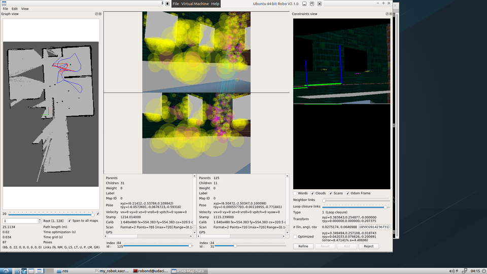

# catkin_rtabmap
Create a 2D occupancy grid and 3D octomap from a simulated environment using a mobile robot with the RTAB-Map package.

## Configuration requires
- A 2D Laser, providing sensor_msgs/LaserScan messages
- Odometry sensors, providing nav_msgs/Odometry messages
- 3D Camera, compatible with openni_launch, openni2_launch or freenect_launch ROS packages

## Usage
1. [Click here](https://github.com/introlab/rtabmap_ros) to install `rtabma_ros`
2. Change working directory to top level and `catkin_make
3. `source devel/setup.bash`
4. Launch the robot inside your world
5. `roslaunch my_robot world.launch`
6. Launch `teleop` node
7. open a new terminal and go into the top level again
8. `source devel/setup.bash`
9. `rosrun teleop_twist_keyboard teleop_twist_keyboard.py`
10. Launch mapping node
11. open a new terminal and go into the top level again
12. `source devel/setup.bash`
13. `roslaunch my_robot mapping.launch`
14. Terminal the node and you could find your map `db` file in the `/root/.ros/` folder
15. Exploring the mapping database
16. `rtabmap-databaseViewer ~/.ros/rtabmap.db`
