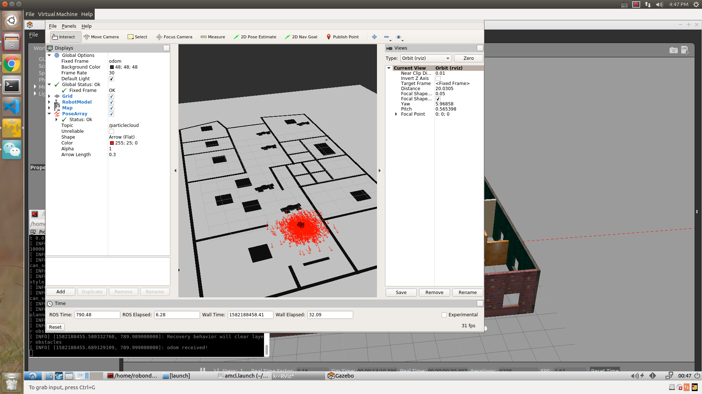
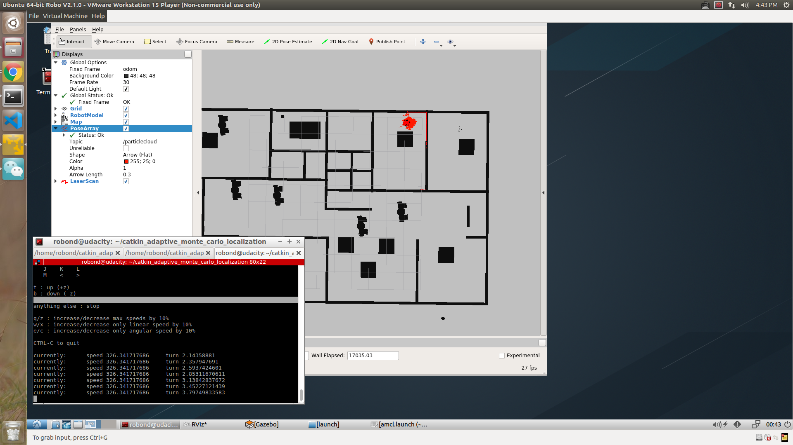

# catkin_adaptive_monte_carlo_localization
AMCL algorithm in catkin workspace, tune the parameter in `src/my_robot/launch/amcl.launch`.

As I tuned the parameters, `max_particles` is not the most important one, as `200` or `5000` all work well in this workspace. But the `update_min_d` and `update_min_a` is the most sensitive ones. It determine how frequency of the amcl runs and so the performance of the algorithm. Less of these two values more accurate but more computational expansive.

Note: The odometry information for this project is received directly from Gazebo, and is equivalent to the ground truth value (no noise expected). So, you need not have to tune these parameters and can leave them at their default values. But feel free to experiment with some values and see if you notice any changes.
See more details on [ROS wiki's amcl page](http://wiki.ros.org/amcl#Parameters).

## Usage
1. Pull the code and go into the top level directory of this project.
2. `catkin_make`
3. `source devel/setup.bash`
4. Launch the robot inside your world
5. `roslaunch my_robot world.launch`
6. Run `amcl` and `move_base` node
7. open a new terminal and go into the top level again
8. `source devel/setup.bash`
9. `roslaunch my_robot amcl.launch`
10. Control the robot
11. open a new terminal and go into the top level again
12. `source devel/setup.bash`
13. If you want control the robot by keyboard run `rosrun teleop_twist_keyboard teleop_twist_keyboard.py`
14. Another method to navigate is sending a `2D Nav Goal` from RViz. The `move_base` will try to navigate your robot based on the localization.
15. Click the `2D Nav Goal` button in the toolbar, then click and drag on the map to send the goal to the robot. It will start moving and localize itself in the process. If you would like to give `amcl` node a nudge, you could give the robot an initial position estimate on the map using `2D Pose Estimate`.
